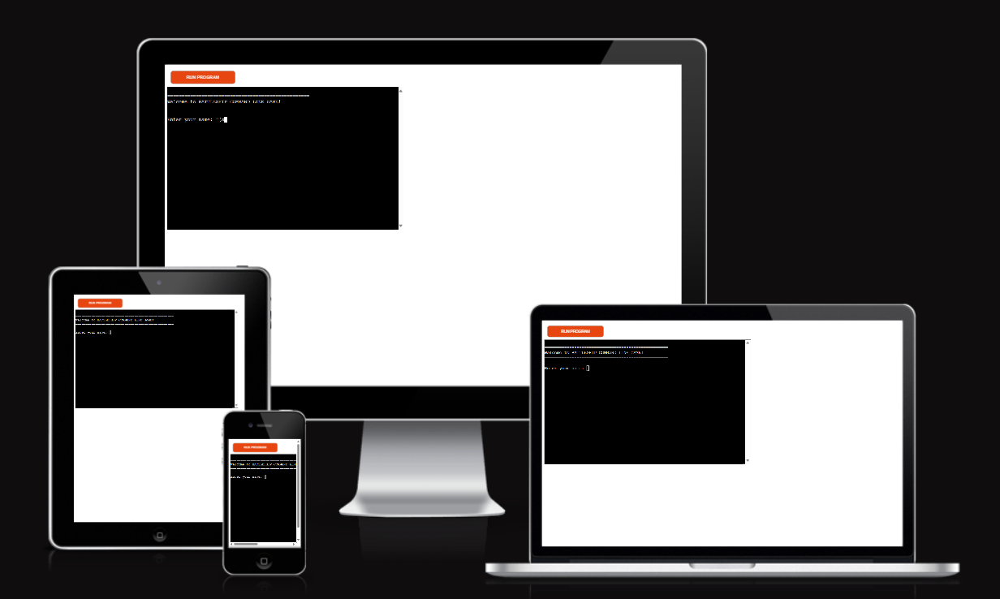
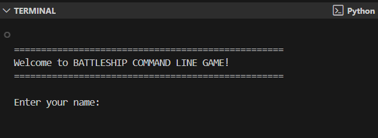

# BATTLESHIP Command Line Game

Battleship is a classic strategy game where players try to sink all of their opponent's ships before the opponent sinks theirs. This Python terminal implementation allows you to play against the computer on customizable grid sizes.

## About the Game

Battleship is based on the classic pen-and-paper game. You can read more about it on [Wikipedia](https://en.wikipedia.org/wiki/Battleship_(game)).

In this version, you enter your name and preferred board size, then attempt to sink all of the computer's ships before it sinks yours.

- Your ships are indicated by 'O', but you cannot see where the computer's ships are
- Hits are marked on the board with an 'X'
- Misses are indicated by 'M'
- The player and computer take turns to make guesses and try to sink each other's battleships
- The winner is the player who sinks all of their opponent's battleships first

## Features

### Existing Features

- **Customizable board size** (5x5 to 10x10)
- **Random ship placement** 
  - Ships are randomly placed on both the player and computer boards
  - The player cannot see where the computer's ships are
- **Intuitive coordinate system**
  - Uses a letter-number grid (e.g., A5, B3) for easy targeting
- **Play against the computer**
- **Interactive gameplay**
  - Clear visual representation of the game boards
  - Game statistics tracking shots and hits
- **Input validation and error checking**
  - You cannot enter coordinates outside the size of the grid
  - You cannot fire at the same coordinates twice
  - Validates input format
- **Data maintained in class instances**

### Future Features

- Allow player to select the board size and number of ships
- Allow player to position ships manually
- Have ships larger than 1x1
- Add different difficulty levels for the computer AI
- Add multiplayer capability
- Add colorful terminal interface

## Data Model

The game uses several classes as its data model:

- **Ship Class**: Stores ship information (name, size, positions, hits)
- **Board Class**: Creates two instances of the Board class to hold the player's and computer's board
- **BattleshipGame Class**: Controls game flow and manages player/computer interactions

The Board class stores the board size, the grid status, the position of the ships, and the shots against that board.

The game also has methods to help play the game, such as:
- `place_ships_randomly()`: Method to place ships on the board
- `receive_shot()`: Method to handle shots and update the game state
- `check_game_over()`: Method to check for win conditions
- `parse_coordinates()`: Method to convert user input to grid coordinates

## Testing

I have tested this project by:

- Running the code through a PEP8 linter and fixed all issues
- Given invalid inputs: strings when numbers are expected, out-of-bounds inputs
- Tested in my local terminal and on Code Institute terminal

### Bugs

- **Solved Bugs**
  - Fixed Linter issue in line 20

- **Remaining Bugs**
  - No bugs remaining

### Validator Testing

- PEP8: No errors returned

## Deployment

This project was deployed using Code Institute's mock terminal for Heroku.

Steps for deployment:
1. Fork or clone this repository
2. Create a new Heroku app
3. Set the buildpacks to `Python` and `NodeJS` in that order
4. Link the Heroku app to the repository
5. Click on **Deploy**

## Credits

- Code Institute for the deployment terminal
- Wikipedia for the details of the Battleship game
- Python documentation for guidance on best practices
